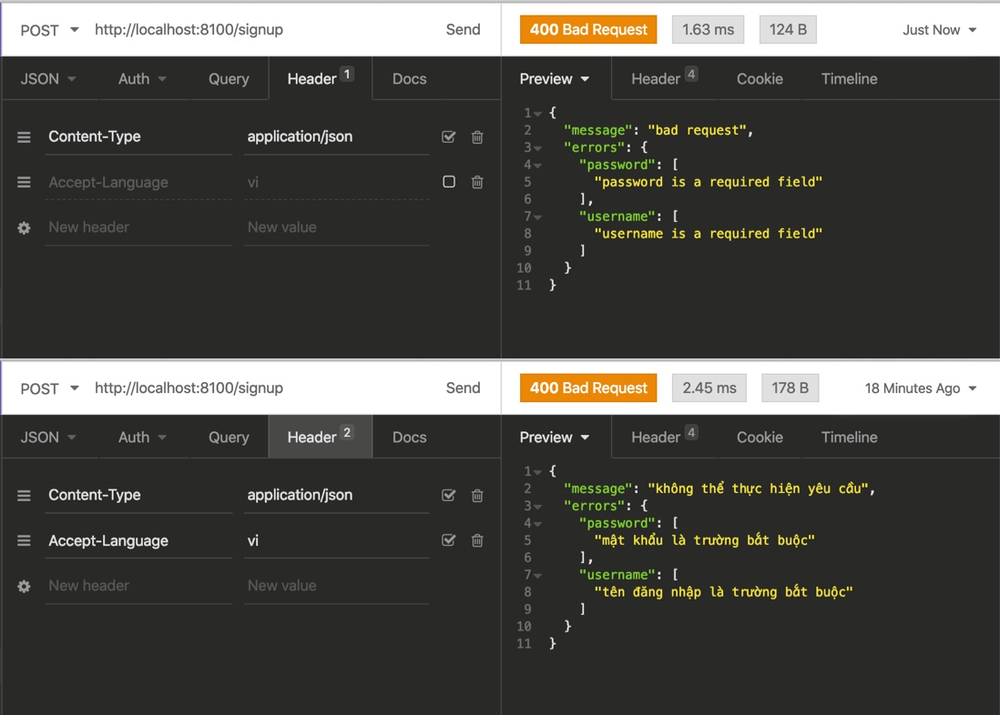

# bloom-be
===================================
Api project use [gin](https://github.com/gin-gonic/gin) + [validator](https://github.com/go-playground/validator) + [goerr](https://github.com/dwarvesf/gerr)

	

## Language
- Golang

## Overview
AkashChat API is an open and permissionless API based on Llama 3.1, designed to facilitate seamless integration of advanced conversational AI capabilities into various applications. This documentation outlines how you can leverage AkashChat API for use in browser extensions, including key functionalities, integration steps, and example use cases.

## Features of AkashChat API
Open Access: No centralized gatekeeping, making it highly accessible.
Llama 3.1 Architecture: Powered by a cutting-edge large language model for contextual and natural interactions.
Permissionless: Easily adaptable to any project without restrictive dependencies.
Scalable: Handles high traffic and supports real-time communication.

## Usage guides
### Prerequisites
#### Technical Requirements

- API Access: Obtain the AkashChat API endpoint URL and key (if applicable).
- Development Environment:golang, docker, postgres(psql),..

#### Setup Instructions
Check the environments set up:
- go version
- psql --version
- docker --version

Step flow:

- git clone https://github.com/Essen-Labs/bloom-be
- cd bloom-be
- export DB_HOST=localhost 
- export DB_PORT=5432
- export DB_USER=admin 
- export DB_PASSWORD=d 
- go run ./cmd/server/main.go
